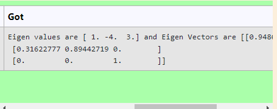

# EIGENVALUES-AND-EIGENVECTORS
## Aim:
To write a python program to find the Eigenvalues and Eigen Vectors
## Equipment’s required:
1. 	Hardware – PCs
2. 	Anaconda – Python 3.7 Installation / Moodle-Code Runner
## Algorithm:
### Step1 :
start the program
### Step 2: 
use numpy module
### Step 3:
Using the np.linalg.eig(),  we get two results (first is eigenvalue and second is eigenvector) of the given matrix.


## Program:

```
#Program to find the eigen values and eigen vectors.
#Developed by: EASWAR
#RegisterNumber:21002130
import numpy
matrix=[[2,-3,0],[2,-5,0],[0,0,3]]
value,vector=numpy.linalg.eig(matrix)
print("Eigen values are",value,"and Eigen Vectors are",vector)
```

## Output:

## Result:
Thus the Eigenvalue and Eigenvector is successfully solved using python program
